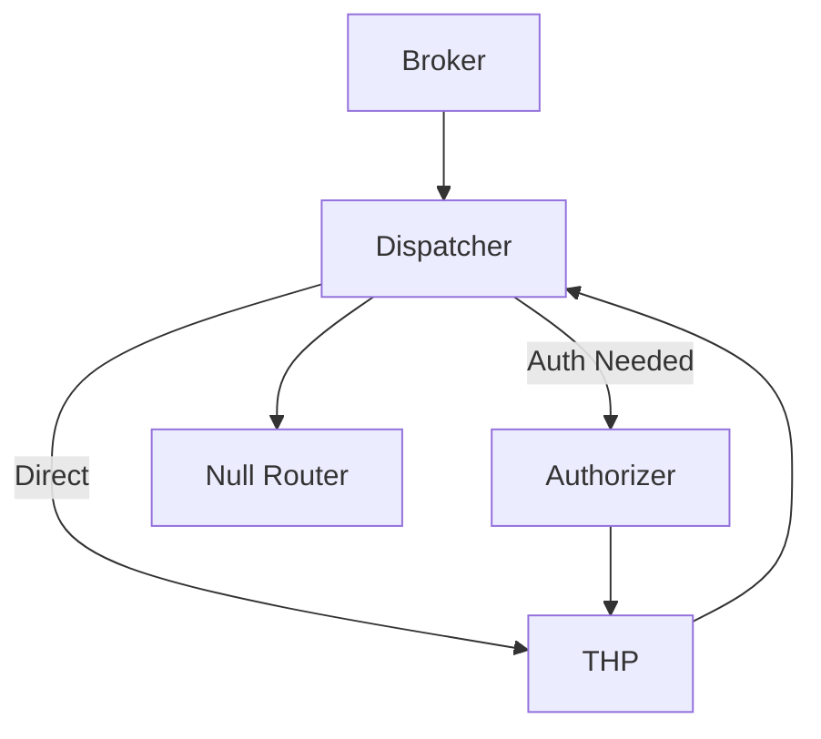

## Transaction Routing Mechanisms in ATM, POS, and Bank Switch Environments

### General Overview

Transaction routing refers to **how ISO 8583 messages traverse the complex web
of acquirers, networks, bank switches, card networks, and issuers**, ultimately
determining transaction approval or denial. The goal is to achieve the highest
rate of successful, secure, and cost-effective transaction processing,
regardless of the transaction source or endpoint.

---

### End-to-End Transaction Flow

**Cardholder Journey Example**:

1. **Initiation**: Cardholder swipes/taps/inserts their card at a terminal (ATM,
   POS, e-commerce gateway).
2. **Terminal Processing**: The terminal captures details (e.g., PAN, amount,
   terminal ID), encodes as an ISO 8583 message (MTI 0100 or 0200 for request).
3. **Routing through Acquirer**: Message is transmitted to the acquiring bank or
   merchant acquirer, often via a payment gateway. The acquirer may perform
   initial validation and formatting.
4. **Switch or Network Routing**:
   - If the destination issuer is not the acquiring bank or is on another
     network, the acquirer sends the message to a payment switch or card network
     (Visa, Mastercard, RuPay, etc.).
   - The **switch/card network** determines the issuer based on PAN/BIN ranges
     and established routing tables, then forwards the transaction.
5. **Issuer Processing**: The issuer bank verifies the transaction
   (authenticates card, checks balance, applies risk/fraud rules).
6. **Response and Settlement**:
   - The issuer crafts an ISO 8583 response message (MTI 0110 or 0210).
   - The response message traverses the same reverse path, ensuring completion
     at the terminal.
   - Successful transactions are subsequently settled in bulk or real time,
     depending on network configuration.

This flow must occur in a matter of seconds to meet customer UX expectations and
network SLAs.

---

### ATM Transaction Routing

In ATM environments:

- ATMs, connected via secure networks (TCP/IP, leased line, or VPN), send ISO
  8583 messages to a **central bank switch** or network interface.
- The central switch performs:
  - **BIN lookup**: Identifies the issuer’s network (e.g., MasterCard, Visa, or
    a domestic network).
  - **Routing Decision**: Forwards message to the appropriate network or
    directly to the issuing bank’s host.
  - **Timeout/reversal Logic**: Handles non-responses with transaction reversal
    messages (e.g., MTI 0420).

Financial switches maintain redundancy, active-passive failover, and
health-check monitoring to ensure high-availability and efficient message
routing even in the face of hardware faults or high loads.

---

### POS Terminal Transaction Routing

POS terminals function similarly but introduce **added complexity**:

- **Diversity of Channels**: Modern POS systems may be physical terminals,
  e-commerce gateways, mobile apps, or QR-based payment apps.
- **Routing by Merchant Acquirer**: Messages are routed to the acquirer or
  processor, which may aggregate transactions from many POS endpoints.
- **Smart/Intelligent Routing**:
  - **Cost-based Routing**: Directs transactions to networks/processors based on
    lowest interchange fees.
  - **Success-Rate Routing**: Chooses processor with highest acceptance
    probability.
  - **Geographic/Currency Routing**: Optimizes acceptance and cost for
    cross-border transactions.
- **Payment Orchestration**: Larger merchants or payment providers use **payment
  switches/orchestrators** capable of dynamic, real-time rerouting for cost,
  speed, reliability, or compliance reasons.

POS transaction flows are increasingly **complex and dynamic**, with
orchestration engines balancing cost, performance, and regulatory needs.

---

### Bank Switches and Card Network Routing

The **payment switch** (also “bank switch” or “central switch”) is the central
nervous system of modern payment routing:

- **Switch Functions**:
  - Receives, parses, and validates incoming ISO 8583 messages.
  - Uses **routing tables** (often BIN-based) to determine the next hop.
  - Applies redundancy, load balancing, failover, and protocol conversions.
  - Performs **logging, reconciliation, tokenization, and reporting**.
  - Ensures PCI-DSS compliance for sensitive data handling.
- **Card Network Roles**:
  - Visa, Mastercard, and similar networks act as global, interoperable routers.
  - Networks may translate ISO 8583 to proprietary extensions, handle
    cross-border routing, and enforce security/fraud controls.

**Dynamic routing** allows switches to re-route based on fee optimization,
network failures, or changes in business strategy, ensuring resilience and
cost-effectiveness for merchants and banks alike.

---

### Payment Switch Architecture and Orchestration

Modern payment switches are sophisticated, modular software systems running
on-premises or cloud infrastructure:

- **Supports multiple message formats and protocols** (ISO 8583, ISO 20022,
  proprietary).
- **Merchant-driven dynamic routing**: Offers automated logic based on BIN,
  cost, volume, or network outages.
- **Token vaults**: Secure storage for sensitive card data, often decoupled from
  the payment service provider (PSP).
- **Advanced analytics**: Provides real-time dashboards for reconciliation
  across multiple end-points/networks.
- **Integrated security and compliance**: Includes encryption, tokenization,
  audit trails, and PCI monitoring.

Switch performance is measured by **throughput (transactions per second),
latency, failover resilience, and ability to scale dynamically** with increasing
transaction volumes. AI/ML capabilities are an emerging feature, enabling fraud
detection and smart routing.

---

### Performance Considerations

- **Low Latency**: Consumer expectations and SLAs require processing each
  transaction in a few seconds.
- **High Throughput**: Switches must scale from thousands to hundreds of
  thousands of TPS (transactions per second) without loss.
- **Scalability**: Architecture should allow horizontal expansion (adding more
  nodes) as needed.
- **Availability/Reliability**: Active-passive or active-active failover, load
  balancers, and health checks are standard.
- **Monitoring and Reporting**: Real-time dashboards track transaction approval
  rates, system errors, and fraud detection alerts.

---

### Security and Compliance

- **End-to-end Encryption**: PIN blocks, PANs, and other sensitive fields must
  be encrypted at rest and in transit.
- **Transaction Authentication and Integrity**: Use of MACs, digital signatures,
  and hashing.
- **PCI-DSS Compliance**: Adherence to evolving industry requirements for
  protecting cardholder data and securing payment processing environments.
- **Incident Management and Reversals**: Automated and manual mechanisms for
  transaction correction in case of errors or anomalies.

Proactive security monitoring, vulnerability assessments, and regular audits are
paramount.

---

### Pros and Cons Table: ISO 8583 vs. ISO 20022

| Aspect              | ISO 8583                                | ISO 20022                                 |
| ------------------- | --------------------------------------- | ----------------------------------------- |
| Foundation Year     | 1987 (multiple revisions)               | 2004, ongoing evolution                   |
| Transaction Types   | Card-based payments/ATMs/POS            | Universal: retail, high-value, securities |
| Message Structure   | Bitmap-based, fixed and variable fields | XML-based, extensible, semantic-rich      |
| Field Extensibility | Moderate; customization often needed    | Very High; incorporates rich, nested data |
| Interoperability    | Mature in card payments, widely used    | Best between banks globally (incl. SWIFT) |
| Data Richness       | Limited (per field specification)       | Rich, allows regulatory, KYC, compliance  |
| Adoption Context    | Card networks, some bank transfer       | High-value payments, SEPA, CBPR+, etc.    |
| Performance         | Optimized for speed, compactness        | Potentially less performant due to XML    |
| Migration Path      | Widely in place, hard to change         | Many networks migrating over next 3+ yrs  |
| Security            | Good, network additions often needed    | Best, with regulatory focus               |

**Summary**: While ISO 8583 remains dominant for card-initiated transactions,
ISO 20022 is the future-proof choice for rich data exchange, universal
messaging, and new digital payment paradigms. Interoperability between them will
be essential for the next decade.

---

### Best Practices for Implementing ISO 8583

- **Validate all incoming fields** rigorously for format, content, and sequence.
  Tolerate only required permutations per use case.
- **Keep field usage documentation up to date** to avoid ambiguous or
  incorrectly formatted messages.
- **Support full audit logging** at the message, field, and routing levels for
  dispute management and compliance audits.
- **Encrypt and mask sensitive data** in both transit and persistent logs.
- **Conduct regular performance/load testing** to ensure resilience and SLA
  compliance under peak loads.
- **Train support teams** on error scenarios, reversal logic, and
  network-specific exceptions.
- **Monitor for field deprecation and network announcements** to remain
  compliant with continually evolving international requirements.

---

## Interview Questions

### Section 1: ISO 8583 Structure and Semantics

#### 1. **What are the three foundational components of an ISO 8583 message?**

**Answer**:

- **Message Type Indicator (MTI):** A 4-digit numeric field that defines the
  message's version, function (authorization, financial, etc.), and
  request/response/advice flow.
- **Bitmap(s):** A set of 64-bit (or more) bitmaps immediately following the
  MTI, indicating which data fields are present within the message.
- **Data Elements:** Up to 128 (or 192) fields defined by the ISO standard, each
  with a specific format and meaning (e.g., PAN, amount, terminal ID, etc.).

---

#### 2. **Break down the meaning of each digit in the MTI “0200”.**

**Answer**:

- `0` – 1987 version.
- `2` – Financial transaction message.
- `0` – Function: Request.
- `0` – Origination: Acquirer.

So, `0200` is a financial transaction request (typically used for purchases,
withdrawals, or balance inquiries initiated by the acquirer).

---

#### 3. **What is the bitmap in ISO 8583 and how is it used?**

**Answer**:  
The bitmap is a field directly after the MTI that indicates, by individual bits
(1 = present, 0 = not present), which data elements are included in the message.
Each bit represents the presence of a data field (from 2 upwards, since field 1
is the bitmap itself), and if the first bit is set, it means a secondary bitmap
follows, representing fields 65–128. Bitmaps enable flexible field presence
without fixed field ordering.

---

#### 4. **How does ISO 8583 accommodate variable-length data fields?**

**Answer**:  
Variable-length fields prepend a length indicator (e.g., LL for up to 99 chars,
LLL for up to 999) before the field value. For instance, a PAN field (Field 2)
may be encoded as LLVAR; “13” would precede a 13-digit card number, telling the
parser to consume only those digits for that field.

---

#### 5. **What is the function of Data Element 39 and give examples of its values.**

**Answer**:  
Field 39, the Response Code, communicates the outcome or status of a
transaction. Key examples:

- `00`: Approved
- `05`: Do not honor
- `12`: Invalid transaction
- `14`: Invalid card number
- `51`: Insufficient funds
- `55`: Incorrect PIN
- `91`: Issuer or switch inoperative See network specification for a complete
  list.

---

#### 6. **Describe how a transaction reversal is handled in ISO 8583.**

**Answer**:  
If a transaction must be reversed (e.g., due to timeout, error, or customer
cancellation), a reversal message is sent using MTI patterns like 0420 (reversal
advice) or 0400 (reversal request), including the original transaction details
(usually by referencing RRN, STAN, and key fields). The responder processes the
reversal (undoing the funds movement if required) and replies with a reversal
response, e.g., 0430. This ensures financial integrity and customer
satisfaction.

---

#### 7. **What are MAC and PIN blocks in ISO 8583?**

**Answer**:

- **MAC (Message Authentication Code):** Field 64 (or 128) provides a
  cryptographic hash for the message, ensuring integrity and authenticity.
- **PIN Block (Field 52):** Presents the customer’s PIN encrypted using industry
  encryption standards (typically Triple DES), providing secure PIN entry and
  verification.

---

#### 8. **How does ISO 8583 support extensibility for new payment technologies or local requirements?**

**Answer**:  
ISO 8583 allows optional (and private/proprietary) data elements, especially in
the 60–128 range, for network-specific uses. Field 55, for example, can carry
EMV or chip data in TLV format, while Field 62 may be used for network-specific
transaction metadata or local business logic.

---

### Section 2: Transaction Routing in ATM, POS, and Bank Switches

#### 9. **Describe the transaction routing flow for a POS transaction using a Visa card.**

**Answer**:

- The customer initiates payment at the merchant’s POS terminal.
- The POS formats an ISO 8583 message and transmits to its acquirer.
- The acquirer examines the card BIN; for Visa cards, the message is routed via
  the VisaNet network.
- VisaNet routes based on BIN to the card’s issuer.
- The issuer processes the transaction (balance, fraud/risk checks) and issues
  an approval or decline.
- This response traverses back through VisaNet, the acquirer, and finally to the
  POS terminal to complete or reject the purchase.

Similar flows apply for other schemes, with routing dictated by the card’s BIN
and the network's switch tables.

---

#### 10. **How do payment switches and orchestrators increase transaction success rates and reduce costs?**

**Answer**:  
Payment switches are designed to:

- Route based on cost (lower interchange/acquirer fees)
- Use success-rate data to avoid unreliable processors
- Support regional processors for localized acceptance
- Implement failover to backup acquirers or networks if the primary is
  unavailable
- Minimize transaction declines and speed up approvals by smart routing

This results in reduced transaction costs, better customer experience, and
higher reliability.

---

#### 11. **List and explain common routing criteria used in advanced payment routing engines.**

**Answer**:

- **BIN-based routing**: Directing traffic based on the card’s issuer BIN.
- **Amount-based**: Large transactions may require different or more secure
  routing.
- **Merchant-based**: Customized per-merchant routing, for loyalty or cost
  optimization.
- **Currency/geography-based**: Different paths for cross-border vs. domestic
  transactions.
- **Success-rate-based**: Adaptive routing to processors/acquirers with higher
  approval rates.
- **Network Availability**: Use real-time health checks and failover logic.

These rules are often configured via admin interfaces or dynamic algorithms in
modern payment orchestrators.

---

#### 12. **How does an Active-Passive Failover system enhance reliability in transaction routing?**

**Answer**:  
Active-Passive Failover ensures that if the primary switch/server fails (as
detected by health checks like CPU load or message processing inactivity), a
secondary (“passive”) node automatically takes over transaction processing. This
provides near-continuous uptime, minimizing lost sales and customer impact.
Failover mechanisms monitor metrics such as transaction per second (TPS), system
health, and network connectivity.

---

#### 13. **What are the performance and scalability requirements for a payment switch?**

**Answer**:

- **High throughput capability**, often tens to hundreds of thousands TPS.
- **Low-latency processing**, to meet customer experience and card network SLAs.
- **Resilience and redundancy**, supporting failover, clustering, and
  load-balancing.
- **Horizontal scalability**, enabling adding more servers on demand.
- **Monitoring and logging**, for real-time performance insight and
  troubleshooting.

These factors ensure reliable payment processing even under peak loads like
Black Friday or regional holidays.

---

#### 14. **How is transaction routing different between ATMs and POS terminals?**

**Answer**:  
While both use ISO 8583, **ATM routing** typically involves direct connections
to a central bank switch (for intrabank ATMs) or interbank/networks (for off-us
withdrawals). **POS routing** often involves merchant aggregators, variable
processors, and a higher degree of dynamic or intelligent routing, with
additional complexities from mobile, unattended, or e-commerce payment channels.
Both require robust security, rapid failover, and end-to-end reconciliation
processes.

---

#### 15. **What is the difference between authorization and financial messages in ISO 8583?**

**Answer**:

- **Authorization (x1xx MTI, e.g., 0100/0110):** Used for pre-approval without
  funds movement. Verifies card, PIN, and funds availability. Funds may be held
  (pre-auth), and settlement occurs in a later step.
- **Financial (x2xx MTI, e.g., 0200/0210):** Used when funds move immediately
  (posting), such as ATM withdrawals or crediting a merchant. Some regions use
  single-message systems (SMS) where authorization and posting are combined,
  others use dual-message systems (DMS) for separation.

The distinction affects handling of reversals, settlement, and risk management.

---

### Section 3: Security, Implementation, and Modernization

#### 16. **What security protocols are commonly used to secure ISO 8583 messaging in transit?**

**Answer**:  
While ISO 8583 does not specify protocols, secure deployment requires:

- **TLS/SSL** for communication channel encryption.
- **Network-level firewalls** and intrusion detection.
- **Application-level MAC fields (64/128) and encryption of PIN/PAN fields**.
- **HSM (Hardware Security Module) integration** for cryptographic key
  management.

These are layered on top of the message format to ensure confidentiality,
integrity, and authenticity.

---

#### 17. **Compare ISO 8583 and ISO 20022 in the context of financial messaging.**

**Answer**:

- **ISO 8583**: Bitmap-based, compact, ideal for card and small-value payments;
  limited data richness, custom encoding per network.
- **ISO 20022**: XML (or ASN.1 JSON), semantically rich, standardized for global
  high-value and real-time payments (SWIFT, SEPA Instant); supports rich
  metadata, compliance, KYC, and analytics.

The industry trend is towards ISO 20022 for comprehensive, interoperable, and
data-rich messaging, but ISO 8583 remains vital for retail/payments due to
established infrastructure and ultra-fast performance.

---

#### 18. **What are best practices for error handling in ISO 8583 implementations?**

**Answer**:

- **Define clear mapping for response codes** and explanatory messages for each
  failure scenario.
- **Automate reversals and retries** in the face of timeouts or partial
  failures.
- **Log all transaction attempts** with adequate metadata for audit and
  troubleshooting.
- **Synchronize STAN and RRN sequences** to prevent duplicates and ensure
  accurate reversals.
- **Regularly test error scenarios in UAT** for resilience and compliance.

Consistent and comprehensive error handling minimizes financial risk and
customer dissatisfaction.

---

#### 19. **How can payment switch performance and resilience be improved with emerging technologies?**

**Answer**:

- **Microservices-based architecture**: Enables modular, auto-scaled deployment
  and easier upgrades.
- **AI/ML for smart routing and fraud detection**: Real-time analytics and
  adaptive learning improve routing success and block fraudulent activity
  faster.
- **Deployment in cloud environments**: Offers on-demand scaling, geographic
  redundancy, and easier disaster recovery.
- **Open API and orchestration**: Accelerates integration with new channels and
  ecosystems.

All of these ensure the payment switch is future-ready and can handle growing
transaction volumes with minimal manual intervention.

---

#### 20. **What compliance obligations must implementers of ISO 8583 systems meet in 2025?**

**Answer**:

- **PCI-DSS** for data security (PAN, PIN, CVV handling, storage, transport).
- **KYC/AML/CFT**: Know Your Customer, Anti-Money Laundering, and Counter
  Financing of Terrorism for certain payment flows.
- **GDPR and regional data privacy laws**: Especially for customer data storage.
- **Network rules**: Scheme-specific security, timeout, dispute, and processing
  requirements.

Non-compliance risks heavy fines, damage to reputation, and loss of network
access.

---

# Deep Technical Guide to Transaction Routing in Financial Systems: ISO 8583 and Card-Based Payment Networks

## Payment Switch / Orchestration Engine Architecture

The **payment switch** (or orchestration engine) is the central command hub of
transaction routing in card-based payment systems. It:

- Connects to multiple external and internal endpoints (channels)
- Dynamically routes transactions between payment service providers (PSPs),
  acquirers, and national/international networks
- Applies customizable merchant- and network-driven rules for transaction
  distribution, retries, and failover
- Normalizes reporting, manages reconciliation, logging, settlement, and
  complies with security mandates such as PCI DSS

Modern switches achieve **sub-second routing, high resiliency (often 99.999%
uptime), and adaptability** needed for both global enterprises and national
instant payment infrastructures.

### High-Level Architectural Flow

```plaintext
[Channel] → [Broker] → [THP] → [Dispatcher] → [Authorizer] → [External Network/Issuer]
                         ↑                                |
                         |<-----------Feedback------------|
```

**Interaction Summary:**

- **Channel:** Entry/exit point for transactions (POS, ATM, web, mobile app,
  network interface)
- **Broker:** Intake and initial message routing (identifies message properties,
  source, possible routes)
- **THP (Transaction Handling Processor):** Manages transaction state,
  validation, rules, and orchestration
- **Dispatcher:** Directs transaction/message flow to/from appropriate endpoints
- **Authorizer:** Approves or denies transactions using issuer/acquirer rules
  and business logic

---

## Core Routing Components: Roles, Functions, and Interactions

### Broker Component in Payment Routing

#### Role

The **broker** is a service layer or module—often the switch’s front door—that
ingests all incoming ISO 8583 (or other supported standard) messages. Its
functions include:

- **Identifying message source, type (using MTI, TPDU, channel metadata)**
- **Applying preliminary routing rules:** Determines whether to process, reject,
  or forward a transaction based on origin, message type, merchant/acquirer
  rules, and system operating state.
- **Acting as the system’s router-of-routers:** If multiple THPs/dispatchers
  exist, selects optimal partition or redundancy group for load balancing,
  geography, or security.
- **Enforcing access control policies:** Prevents flooding, invalid transaction
  types, or fraudulent endpoints from entering the core routing logic.

#### Typical Logic and Example

Upon receiving a transaction:

- Reads MTI and key data elements (e.g., PAN, processing code).
- Matches the request against configured rules (e.g., by merchant, terminal ID,
  BIN range, transaction type).
- Forwards valid/recognized requests to a THP instance or rejects/bounces
  invalid or suspicious ones.

In cloud-native or microservices architectures, the broker also manages
distributed message queues (e.g., Kafka, RabbitMQ), ensuring asynchronous flow
and resilience.

**Example:** Primer’s orchestration engine, as a broker, exposes a single API
interface but connects to multiple acquirers/PSPs behind the scenes. This
drastically simplifies merchant integrations while keeping routing logic
centralized.

#### Broker in TPDU Context

When using legacy networks or systems with no built-in routing in ISO 8583, a
**TPDU** header (Transaction Protocol Data Unit) can be used. Routers examine
TPDU’s protocol ID, destination address, and source address to forward messages
to the correct system.

---

### Authorizer Component in Payment Routing

#### Role

The **authorizer** is responsible for the critical decision: to approve or
decline a transaction. It represents the authority tied to an account (issuer or
acquirer), and applies both static and dynamic controls including:

- **Balance and credit/funds check**
- **Card and account status checks** (valid, blocked, limits, expiry)
- **Transaction velocity and fraud checking** (e.g., first use, geolocation,
  excessive usage detection)
- **PIN/CVV/3DS and risk/fraud scoring validation**
- **Regulatory compliance checks** (e.g., sanctions, KYC, SCA)

Authorizer modules may run in the issuer's core, within a PSP, or as a
specialized engine tightly integrated with THP and dispatcher.

#### Technical Process

1. **Receives transaction details** via ISO 8583 (fields 2, 3, 4, 11, 14, etc.).
2. **Validates all card/account details**—may consult external/auth servers or
   use in-memory caches for performance.
3. **Assigns internal transaction reference or authorization code**.
4. **Issues a response with standardized codes**:
   - `00` = Approved
   - `05` = Do not honor
   - `12` = Invalid transaction
   - `91` = Issuer/switch inoperative
5. **Optionally triggers risk events**: e.g., notify fraud teams, block
   merchant/card.

Responses are structured in ISO 8583 and may contain custom fields for internal
reconciliation.

#### Example Interactions

When an authorization request (MTI 0100) is received:

- The authorizer quickly checks key fields (e.g., 2: PAN; 3: processing; 4:
  amount)
- It consults account ledgers, risk and rule databases, possibly third-party
  fraud systems, then issues field 39 and, if approved, a unique code in field 38.

---

### Transaction Handling Processor (THP)

#### Role

The **THP** is the conductor and stateful logic engine at the heart of a payment
switch. Its responsibilities encompass:

- **Parsing, validating, and enriching every incoming ISO 8583 message**
- **Managing transaction state and audit trail** through fields like the System
  Trace Audit Number (STAN, field 11), retrieval reference number (field 37),
  and others
- **Applying business rules:** Routing decisions, fraud scoring, risk-based
  authentication triggers, retries/cascading failover if a preferred path fails
- **Maintaining in-flight transaction memory:** Enables reversals, repeats, and
  state transitions (initiated → authorized → settled)
- **Coordinating with dispatchers and brokers for failover and redundancy**
- **Handling exceptions:** Logging, alerting, passing failed transactions to
  fallback logic

#### Architectural Features

- Scalable THPs often run as stateless workers, with state persisted in
  high-availability, fast-access data stores (e.g., Redis, Cassandra, SQL).
- In distributed environments, each THP can process thousands of concurrent
  requests per second.
- THPs also carry out protocol normalization and message enrichment,
  accommodating different acquirer/issuer dialects, custom field packing, or
  compliance triggers.

#### Real System Example

In a Java-based orchestration engine (e.g., JPos, Jreactive8583), a THP:

- Loads ISO definitions, message schemas, and routing logic at startup.
- On incoming transaction, parses bitmap and extracts required fields.
- Executes pre-authorization checks, validation, and sends message to the
  Dispatcher along with routing metadata.

---

### Dispatcher Component in Orchestration Engine

#### Role

The **dispatcher** directs each processed transaction to the most appropriate
"next hop," which could be an acquirer, external card network, issuer host, or
advanced fraud solution.

- **Receives validated/augmented messages from THP**
- **Selects appropriate physical/logical channel** based on sophisticated
  routing tables:
  - Card type (Visa, Mastercard, UnionPay)
  - BIN, region, issuer preference
  - Current system health, SLA, or cost
- **Handles transmission protocol selection:** TCP/IP, HTTP REST, MQ, etc.
- **Ensures delivery, manages timeouts, and captures/delivers asynchronous
  responses**
- **Implements load balancing and A/B testing**
- **Logs delivery/receipt stats for real-time monitoring**

Dispatchers must tolerate endpoint failures, slowdowns, and ensure retries and
alternates are attempted with minimal delay.

#### Example

A dispatcher configured with three acquiring endpoints (Acquirer A for local
Visa, Acquirer B for Mastercard, Acquirer C for fallback):

- Parses each transaction's DE32 or DE100.
- Assigns a connection (or asynchronous task) to the matched acquirer,
  monitoring response.
- If a timeout or "issuer unavailable" code is returned, can trigger a
  programmed failover or fallback to another acquirer (cascading).

#### State Transitions Managed by Dispatcher

| Status            | Description                    |
| ----------------- | ------------------------------ |
| Awaiting Dispatch | Transaction ready for dispatch |
| In Process        | Currently being delivered      |
| Dispatched        | Sent to external endpoint      |
| Awaiting Response | In-flight, waiting for result  |
| Complete/Error    | Settled or errored             |

---

### Channel Component in Payment Systems

#### Role

A **channel** in payment systems refers to the system interface or logical
endpoint used for message ingress/egress. Channels embody the specific
connection to:

- Acquiring banks or institution
- Card scheme processors (VisaNet, Mastercard MIP, etc.)
- Issuer banking platforms
- External fraud or token service providers
- Merchant systems

Channels abstract the following:

- **Network protocol requirements**: ISO 8583 over TCP/IP, HTTP(S), SSL/TLS,
  SFTP
- **Message formatting:** TPDU headers, proprietary field layouts, or protocol
  wrappers
- **Encryption / keys / HSM integration:** PCI DSS, EMV, tokenization, etc.
- **Health and state monitoring:** Connection persistence, availability, echo
  tests, latency stats.

#### Channel Types: Examples

| Channel Type      | Use Case                                  | Transport/Format           |
| ----------------- | ----------------------------------------- | -------------------------- |
| POS Terminal      | Retail purchase to acquirer               | ISO 8583, TPDU over TCP/IP |
| ATM Driver        | Cash withdrawal from bank network         | ISO 8583, TPDU over X.25   |
| eCommerce Gateway | Online payments to PSP                    | REST/JSON, proprietary XML |
| Card Scheme Link  | Visa, Mastercard connectivity for routing | ISO 8583, NII              |
| Fraud/3DS Module  | Real-time authentication and risk scoring | SOAP, REST/JSON, or 8583   |

---

## Routing Logic and Decision Algorithms

### Decision Making at Each Routing Step

Routing logic is at the core of both the switch and orchestrator:

- **Rule-based Routing:** Preconfigured, merchant-driven, or PCI/BIN-based rules
  (e.g., "all Visa debit <amount X route to Acquirer A")
- **Dynamic, Data-driven Routing:** Real-time performance metrics, current
  network health, authorization success rates, combination with machine learning
  (e.g., "route to the acquirer with best approval rate or lowest current
  latency")
- **Cascade/Fallback Logic:** Automated retries on alternate acquirers/networks
  upon decline, timeout, or system failure
- **Cost and Efficiency Optimization:** Least Cost Routing (LCR), highest
  authorization probability channels, or local vs. cross-border acquirer
  selection
- **Regulatory/Compliance Routing:** Enforcement of SCA, KYC, AML, PCI DSS, PSD2
  rules as required by jurisdiction

#### Decision Inputs: Common Data Elements Used

| Field  | Description                       | Used For                          |
| ------ | --------------------------------- | --------------------------------- |
| 2      | PAN (Card Number)                 | BIN routing, issuer ID            |
| 3      | Processing Code                   | Transaction type selection        |
| 4      | Transaction Amount                | Amount-based routing/fraud        |
| 7      | Transmission Date/Time            | Logging, performance tracking     |
| 11     | STAN                              | Uniqueness, tracking, response    |
| 32/100 | Acquirer/Receiving Institution ID | Network endpoint matching         |
| 39     | Response Code                     | Handling declines, fallback logic |

#### Decision Algorithms: Examples

| Condition                  | Routing Outcome                         |
| -------------------------- | --------------------------------------- |
| Card Type = "Visa"         | Route to Acquirer X                     |
| Amount > 1,000 EUR         | Route to risk-scoring/fraud before auth |
| Geolocation = "EU"         | Apply SCA, then route to EU acquirer    |
| 3DS required (DE 40,41,43) | Trigger 3DS challenge                   |
| Declined by Acquirer 1     | Retry via Acquirer 2 (cascading)        |

---

## Transaction Flow and State Management

Every transaction has a defined lifecycle, tracked by the THP and supporting
modules:

**Typical States:**

- INITIATED
- VALIDATED (pre-authorization)
- ROUTED (dispatcher assigned)
- AUTHORIZED/DECLINED (by authorizer)
- REVERSED/REFUNDED/CANCELED (via reversal messages MTI 0400, 0420)
- COMPLETED/SETTLED (clearing, settlement transmission)

**Key tracking fields:** STAN (DE 11), retrieval reference (DE 37),
authorization code (DE 38), message timestamps (DE 7, 12, 13), and original data
elements (DE 90).

---

## High Availability, Scalability, and System Performance

### Design Considerations for Modern Switches

- **Horizontal Scalability:** Stateless brokers, load-balanced dispatchers, and
  distributed THPs
- **High Availability:** Active-active or active-standby configurations,
  hot-failover, automated health checks, and cascading retries
- **Performance Optimization:**
  - Asynchronous message queues
  - Thread pooling and parallel connections to channels
  - Caching of frequent routing lookups and external directory information
  - Health and latency monitoring with proactive route shifting
- **Security and Compliance:**
  - Encrypted connections, PCI DSS-compliant processing, HSM key management
  - Real-time fraud analysis, 3DS enforcement, and continuous monitoring

---

## Error Handling and Fallback Mechanisms

### Error Types and Routing Responses

#### Soft vs. Hard Declines

| Error Type   | Routing Response           | Example Codes   |
| ------------ | -------------------------- | --------------- |
| Soft Decline | Retry on alternate route   | 91, 68, timeout |
| Hard Decline | Halt, escalate to customer | 05, 14, 04      |

- **Soft declines:** Temporary issues (network, issuer unavailable). System can
  attempt cascading or alternate routing without disrupting user experience.
- **Hard declines:** Permanent or fraud-related (card blocked, stolen, closed)
  triggers customer notification and stops further attempts.

#### Retry and Fallback Logic

- **Exponential backoff:** Wait and retry failed transactions, especially for
  timeouts or transient system errors.
- **Smart failover:** Automatically redirect to backup PSPs, acquirers, or card
  networks based on routing configuration.
- **Regulatory compliance:** Prevent endless recycles for the same transaction
  (e.g., Mastercard’s “Do Not Retry” advice codes). The orchestration logic may
  block repeated attempts to avoid penalties.

**Critical performance metrics:** Failure rate, time-to-recovery, fallback
conversion rate, and system alerting frequency.

---

## Sample Transaction Routing Flow: Diagram

```mermaid
graph TD
    S[POS/ATM/Online Channel] --> B[Broker]
    B --> T[THP (Transaction Handling Processor)]
    T --> D[Dispatcher]
    D --> C{Channel}
    C --> A[Issuer/Authorizer/PSP]
    A --> D
    D --> B
    B --> S
```

**Explanatory Steps:**

1. Channel captures the transaction and normalizes to ISO 8583
2. Broker parses, applies initial rule, forwards to THP
3. THP validates, tracks, and augments transaction state
4. Dispatcher assigns route/channel and forwards to destination
5. Issuer/Authorizer processes transaction, returns response
6. Flow returns through dispatcher, broker, to originating channel

---

# Technical Guide to Transaction Routing in Iran’s Banking System

## Architecture Overview of Iran’s Banking Transaction Routing

At its core, **the Iranian payment network is structured in several critical
tiers**:

- **Customer endpoints**: ATMs, POS (Point-of-Sale) terminals, online payment
  gateways.
- **Bank & third-party switches/processors**: Each major acquiring and issuing
  institution operates its own switch that aggregates transactions from its
  endpoints.
- **National interbank network (Shetab)**: A centralized switch that
  orchestrates the routing, authorization, clearing, and settlement of
  transactions between all Iranian banks and processors.
- **Central regulatory and supervisory layer**: The Central Bank of Iran (CBI)
  oversees both operational and compliance frameworks, and manages national
  clearing and settlement via systems such as RTGS (Real Time Gross Settlement).

**Figure 1: Iranian Banking Transaction Routing Architecture**

| Layer                    | Main Components                        | Main Role                                      |
| ------------------------ | -------------------------------------- | ---------------------------------------------- |
| Endpoints                | ATMs, POS, e-commerce, mobile wallets  | Transaction origination/capture                |
| Acquirer/Issuer Switches | Bank/PSP processors, PSP switches      | Transaction aggregation/auth/clearing          |
| Interbank Network        | Shetab, Shaparak                       | National routing, interoperability, compliance |
| Regulatory Oversight     | Central Bank (RTGS, oversight systems) | Regulation, settlement, systemic resilience    |

Each transaction, regardless of channel (ATM, POS, online), flows from the
originating endpoint through the issuer/acquirer’s switch, is standardized
(typically via ISO 8583), and then routed through the Shetab or Shaparak
networks as determined by transaction type and endpoint. Clearing and final
settlement happens through the Central Bank’s RTGS and other clearing
mechanisms.

---

## Key Entities: Shetab, Shaparak, the Central Bank, and Domestic Switches

### Shetab: The National Interbank Network

**Shetab** (Shabakeh-ye Tabadol Ettelaat Banki, or Interbank Information
Transfer Network) is the backbone of Iran’s card-based transaction ecosystem.
Initiated in 2002 and fully operational by the mid-2000s, Shetab unified
previously fragmented bank card networks under one interoperable umbrella. All
card transactions, including those at ATMs, POS, and increasingly via online
channels, must be routed through Shetab if they involve more than one
institution. As a result, Shetab provides for:

- **Interbank interoperability**: All Iranian banks’ cards can be accepted at
  any ATM or POS in the country.
- **Uniform messaging and transaction rules**: Standardizes transaction
  processing, error handling, and dispute mechanisms.
- **Centralized risk oversight and reporting**: Enables monitoring, anti-fraud
  operations, and systemic risk management.

By 2024, Shetab supports over 340 million issued cards and processes billions of
transactions annually. It is operated by **the Informatics Services Corporation
(ISC)** under the Central Bank’s supervision. Shetab is also leveraged for
cross-border network connectivity—recently linked with Russia’s MIR system and
several other regional networks.

### Shaparak: National Payment Gateway and POS Oversight

**Shaparak** (Shabakeh-ye Pardakht Keshvar) was launched in 2011 as the national
retail payments network, initially to bring uniformity and security to the
growing POS (point-of-sale) market. Its current mandate covers:

- **Managing all POS and internet payment transactions**: All acquirers, PSPs,
  and POS endpoints must route transaction data through Shaparak.
- **Enforcing technical, security, and KYC/AML compliance**: All endpoints,
  merchants, and PSPs must be certified compliant.
- **Central merchant registry**: All merchants accepting card payments are
  registered and monitored via Shaparak.

Shaparak, by design, acts as an intermediate regulatory and technical layer
between PSPs (Payment Service Providers) and the banks/Shetab system. It
centralizes risk monitoring, merchant data, and compliance functions, while also
aggregating transaction reporting for the Central Bank.

### Central Bank of Iran (CBI)

The **Central Bank of Iran** is the supreme regulatory authority responsible for
the stability, oversight, and development of all national payment systems. Key
functions include:

- **RTGS and bulk settlement**: Large-value interbank settlement, central
  account management for banks, and national clearing functions.
- **Supervisory framework**: Mandates licensing, regulates KYC/AML, and dictates
  electronic banking policy and infrastructure development.
- **International coordination**: Oversees the limited cross-border integration
  via non-SWIFT rails, including the recent Russia MIR–Shetab bridge.

### Domestic Switches and Processors

Each Iranian bank and licensed Payment Service Provider (PSP) operates a
dedicated domestic switch or processor. These switches perform:

- **Transaction capture and formatting**: For ATMs, POS, and e-commerce, using
  ISO 8583 messaging.
- **Initial validation and authorization**: Verifies balance, cardholder
  credentials, account standing.
- **Routing to Shetab or Shaparak**: For interbank, inter-PSP, or merchant
  transactions.

Notable PSPs and processors include **Behpardakht Mellat, Saman Electronic
Payments (SEP), Parsian E-Commerce, Asan Pardakht, and others**.

---

## Transaction Flow and Routing Components

### ATM Transaction Flow

1. **Initiation**: Cardholder inserts a bank card at any ATM, selects
   transaction type (withdraw, balance inquiry, etc.)
2. **Local Switch**: ATM’s host bank switch captures details, formats an ISO
   8583 message, and applies initial checks.
3. **Shetab Routing**: If the card is not from the ATM’s host bank, transaction
   is sent to the Shetab central switch.
4. **Issuer Bank Switch**: Shetab routes to the card-issuing bank, which makes
   the final authorization decision.
5. **Response Propagation**: The authorization or denial travels back, and the
   ATM dispenses cash or provides service accordingly.
6. **Settlement**: At end of clearing cycle, Shetab aggregates data for
   interbank settlement via the CBI’s RTGS.

**Diagram: ATM Transaction Routing**

```
[Customer] --> [ATM Terminal] --> [ATM Host Bank Switch]
      |                                          |
      |----------------------via Shetab---------->|
                              |
                      [Issuing Bank Switch]
                              |
                   (auth decision + balance check)
                              |
             <------via Shetab-------------------|
```

**Key Characteristics and Controls:**

- All connectors (ATM, host, Shetab, issuer) use tightly specified ISO 8583
  messaging.
- PIN block security and HSM (Hardware Security Module) for PIN encryption.
- Anti-fraud checks at multiple points; transaction logs propagated to CBI and
  operator’s security centers.

### POS Terminal Transaction Flow

1. **Purchase**: Customer presents debit card at POS terminal.
2. **POS Device**: Device encrypts data and transmits it to acquiring
   bank’s/PSP’s switch.
3. **Shaparak PSL**: Transaction first hits the Shaparak gateway, which screens
   for compliance and merchant validity.
4. **Shetab Clearing**: For interbank transactions, Shaparak hands over to
   Shetab for interbank routing.
5. **Issuer Switch**: Card-issuing bank’s system makes the final call.
6. **Approval/Decline**: Transaction response is returned via the reverse path;
   funds are held/reserved for batch settlement.
7. **Settlement**: At the end of each cycle, Shaparak orchestrates batch
   merchant settlement after reconciliation with all involved banks.

**Diagram: POS Purchase Routing**

```
[POS Device] --> [PSP/Acquiring Bank Switch] --> [Shaparak]
      |                                              |
      |-------------------(if interbank)------------>|
                                  |
                            [Shetab Network]
                                  |
                      [Issuing Bank Switch]
```

**Key Controls:**

- Shaparak enforces strong merchant/POS terminal registration, endpoint
  security, and transaction pattern analysis (for fraud/KYC checks).
- Transaction logs and merchant data are centralized for regulatory auditing.

### E-Commerce / Online Payment Transaction Flow

1. **Checkout**: Customer enters payment details at online merchant site.
2. **Payment Gateway (Shaparak/PSP)**: Payment page is either hosted by or
   API-linked via a PSP to Shaparak.
3. **Credential Handling**: Sensitive info is encrypted and delivered to
   PSP/Acquirer switch.
4. **Routing**: Follows similar flow as POS (Shaparak → Shetab → Issuer), with
   added layers for CVV2, 3D-Secure, tokenization, etc.
5. **Result**: Approval/denial returned to merchant and customer.

**Specific Features:**

- All Iranian e-commerce PSPs must be certified by Shaparak for integration.
- Transaction logs must be maintained for at least five years for regulatory
  traceability and fraud monitoring.

---

## Security, Compliance, and Network Controls

### Security Mechanisms

**1. Encryption and PIN Security**

- All PIN entries from ATM/POS are encrypted at the device.
- HSMs (Hardware Security Modules) used at every switch and by all network
  components for key management and PIN/TLV encryption.
- SSL/TLS encryption on all interbank and internet-facing channels.

**2. Tokenization and Masking**

- Sensitive information such as PAN (card numbers) is tokenized in many payment
  gateways and only decrypted at critical nodes.

**3. End-to-End Authentication**

- Mutual TLS authentication required at all switch-to-switch connections.
- Network devices (ATMs, POS) must be registered and carry cryptographic
  identities.

**4. Real-time Fraud Detection**

- All transactions are monitored for anomalies (velocity, location, merchant
  risk, etc.) both within Shetab and at the issuing institution, with alerts
  sent to CBI and relevant parties.

**5. Secure Coding and Penetration Testing**

- All PSPs and bank IT platforms undergo regular security audits, code reviews,
  and penetration testing before being connected to Shetab or Shaparak.

### Compliance and Regulatory Controls

- **KYC/AML Enforcement**: Mandatory at account/card creation and merchant
  acquisition, with Shaparak and CBI setting standards for proof of ID,
  beneficial ownership, ongoing transaction monitoring, and suspicious activity
  reporting.
- **PCI DSS Equivalents**: Although Iran is not a participant in the global
  PCI-DSS regime due to sanctions, local regulations enforce largely equivalent
  technical, operational, and reporting standards for all payment processors,
  banks, and PSPs.
- **Audit Trails and Retention**: All approved payment entities must keep
  transaction logs for at least five years, available for on-demand regulatory
  audit.
- **Security Breach Reporting**: Immediate notification of data breaches or
  operational outages is mandatory to CBI, and affected customers must be
  notified as per CBI guidelines.

### Performance & Availability Controls

- **Redundant Infrastructure**: All key platforms (Shetab, Shaparak, RTGS)
  operate in high-availability mode with geographic redundancy; datacenters in
  Tehran, Isfahan, and other regions ensure disaster recovery.
- **Scalability**: Architecture supports billions of transactions per year, and
  systems are regularly tested for stress and failover scenarios.
- **Monitoring/Alerting**: 24x7 NOC operation at core switches, with automated
  alerting for anomalies and long transaction latencies.

---

## Illustrative Transaction Flows and International Integration

### Sample Routing Path: Cross-Bank POS Transaction

Suppose a Mellat Bank card is used at a merchant whose acquiring bank is
Parsian. The simplified routing would be:

1. Customer presents Mellat Bank card at merchant’s POS.
2. POS (certified, registered on Shaparak) sends transaction to Parsian’s PSP
   switch.
3. Parsian switch forwards transaction to Shaparak.
4. Shaparak identifies card belongs to Mellat Bank, routes to Shetab.
5. Shetab sends transaction to Mellat’s switch.
6. Mellat authorizes or declines based on card status, balance, and risk
   profile.
7. Response sent back via Shetab → Shaparak → Parsian PSP → POS terminal.
8. Shaparak and Shetab record transaction for reconciliation; end-of-day netting
   performed and CBI RTGS settles between Mellat and Parsian.

### Example: ATM Cash Withdrawal from Non-Issuer Bank

A customer with a Saman Bank card uses an ATM belonging to Bank Melli.
Transaction is processed as:

- ATM → Melli Bank Switch → Shetab → Saman Switch → Authorization.
- Funds debited from Saman customer account, Shetab calculates interbank
  obligation.
- Customer receives cash from Melli ATM, transaction record posted on both
  banks.

### International Integration: Shetab–MIR Bridge

Since July 2024, Shetab has been linked with Russia’s MIR payment system. Steps
include:

- Card issued by Iranian bank (on Shetab) is used at a Russian ATM/POS.
- MIR switch recognizes Shetab BIN, routes to Shetab via secure cross-border
  protocol; Shetab routes to Iranian bank.
- Authorization and approval flows returned; local currency issued.
- Settlement is handled between central banks using correspondent accounts and
  specific protocols designed to bypass SWIFT.

---

## Summary Table: Routing Pathways and System Components

| Transaction Type   | Endpoint           | Initial Switch       | Intermediary Layer   | Central Network       | Issuer/Processor | Settlement System       |
| ------------------ | ------------------ | -------------------- | -------------------- | --------------------- | ---------------- | ----------------------- |
| ATM Withdrawal     | ATM                | ATM Host Bank Switch | Shetab Central       | Shetab                | Issuer Switch    | CBI RTGS                |
| POS Purchase       | POS Terminal       | Acquirer/PSP Switch  | Shaparak             | Shetab (if interbank) | Issuer Switch    | Shaparak, then CBI RTGS |
| Online Payment     | Web/Mobile         | PSP/Acquirer Switch  | Shaparak             | Shetab (if interbank) | Issuer Switch    | Shaparak, then CBI RTGS |
| Cross-border (MIR) | MIR/Shetab ATM/POS | MIR/Shetab Switch    | Cross-border gateway | Shetab/MIR            | Issuer Switch    | Bilateral Central Bank  |
| Funds Transfer     | Bank/kiosk         | Customer Bank Switch | Shetab Core          | Shetab                | Recipient Bank   | Shetab/CBI “Sahab”      |

---

# Deep Technical Guide to Switch Router Components and Execution Order in Iran’s Banking System

**High-Level Architecture Diagram: Iranian Payment Switch**

```plaintext
[User/Device]
    |
    v
[Channel Module]
    |
    v
[Broker]
    |
    v
[Dispatcher]
  /           \
 v             v
[Authorizer]    [THP]
    |             |
    v             v
[Null Router]  [Core Banking/Ledger]
```

---

Each layer in this architecture is explored in detail in the following sections.

---

## The Channel Module

### Role and Technical Operation

**Channels** act as adaptation layers, interfacing with diverse external
systems—ATM/POS hardware, mobile apps, e-commerce platforms, or other payment
networks. Their main responsibilities include:

- _Message Capturing:_ Channels capture transaction inputs from terminals or
  APIs (e.g., withdrawal, fund transfer, balance inquiry).
- _Protocol Formatting:_ Incoming data is normalized into ISO8583 messages or
  institution-specific dialects, ensuring protocol consistency for internal
  processing.
- _Network Communication and Encryption:_ Channels manage transport-level
  connectivity (TCP/IP, HTTP/S, VPN, etc.), enforce message-level encryption,
  ensure secure key exchange—often leveraging HSM (Hardware Security Module)
  technology for PIN blocks and MACs.
- _Session Management/Reliability:_ Channels maintain connection pooling, manage
  retries, timeout logic, and monitor link health.
- _Immediate User Feedback:_ Channels are often tasked with relaying transaction
  outcomes and error codes back to users in real time.

### Execution Order

In the transaction flow, the **Channel Module** is always the entry and exit
point for transaction data. It sits at the front and back of the switch:

1. **User initiates transaction** (insert card, tap NFC, enter details) at ATM
   or POS.
2. **Channel fetches, formats, and transmits data** into ISO8583-compliant
   message.
3. The message is **forwarded to the internal Broker** (see next section).
4. Upon processing and result generation, the **Channel receives the response**
   and delivers it to the user or upstream integration.

Channels often differentiate requests based on external source, port, or
protocol signatures, enabling the broker to route messages appropriately.

---

## The Broker Module

### Role and Technical Operation

The **Broker** acts as the primary intelligence layer—the switch’s “traffic
controller” or mediator. Its main functions are to:

- _Parse, Validate, and Classify Requests:_ The broker reviews transaction
  messages (identifies MTI, checkscards, parses key ISO8583 fields), quickly
  discerning the desired transaction type.
- _Dynamic Routing:_ Using routing rules mapped to transaction properties (e.g.,
  origin channel, card type, amount, institution code, transaction code), the
  broker identifies which downstream module (Authorizer, THP, etc.) is
  appropriate for further processing.
- _Concurrent Session Management:_ Scalable brokers leverage queues and thread
  pools for concurrent transaction handling, supporting real-time processing
  even at high transaction volumes.
- _Failover and Robustness:_ In case of inability to match a routing rule,
  brokers provide safe fallbacks, redirecting transactions to the null router
  (for errors) or alternate THP instances in case of overload.

### Execution Order

Within the transaction lifecycle, the **Broker** is invoked after message
structuring by the Channel and before deep processing or validation modules:

1. **Receives ISO8583 message** from the Channel.
2. **Parses MTI, bitmap, and key data elements** to classify the transaction
   type and extract needed metadata.
3. **Evaluates routing policies**, typically embedded as mapping tables or rules
   engines (hash-based, regex, conditional logic, etc.).
4. **Forwards message** to the next module: usually Authorizer for
   card/not-present and regulated transactions, or directly to THP for simple
   intra-bank or low-risk operations.
5. In case of unmatched/malformed messages, **sends to Null Router** for
   efficient dropping and error isolation.

**Example Broker Routing Table:**

| Channel   | Transaction Type | Forwarded To | Priority  |
| --------- | ---------------- | ------------ | --------- |
| ATM       | Withdrawal       | Authorizer   | High      |
| POS       | Sale             | Authorizer   | High      |
| MobileApp | Balance Inquiry  | THP          | Normal    |
| ATM       | PIN Change       | Authorizer   | Normal    |
| POS       | Unknown MTI      | Null Router  | Immediate |

This table is illustrative—actual logic is governed by complex institutional and
regulatory requirements.

---

## The Dispatcher Module

### Role and Technical Operation

The **Dispatcher** orchestrates internal message flows—essentially managing “who
gets the message next” following initial broker-based routing. Its capabilities
include:

- _Message Flow Control:_ Dispatcher is responsible for message sequencing,
  matchmaking transactions with the appropriate internal processors (Authorizer,
  THP, Null Router, etc.).
- _Advanced Routing/Load Balancing:_ Depending on system load, processor health,
  or redundant deployment, the dispatcher intelligently selects which available
  THP or validation path to invoke.
- _Cascading and Retry Logic:_ On failure or decline from a chosen module,
  dispatcher may reroute to alternate modules, enabling cascading
  authorizations, fallback attempts (e.g., to a backup host), or multi-path
  settlement.
- _Timeout and Error Handling:_ If modules do not respond in configured time,
  dispatcher initiates error routing (to Null Router), logs transaction for
  review, and ensures graceful degradation.

### Execution Order

Dispatcher receives parsed and pre-classified transaction “objects” (messages)
from the broker and manages routing until final transaction disposition:

1. **Receives transaction dispatch request** (object) from Broker.
2. **Invokes target component**—often the Authorizer for authorization requests,
   else THP for direct processable activities.
3. _If required_, dispatcher manages **failover/reroute** in case the downstream
   processor fails or returns specific error codes.
4. On completion, **pulls together response** (approval, decline, or error) for
   return to the Broker and then Channel.

**Dispatcher Flow Example (Diagram):**



---

## The Authorizer Component

### Role and Technical Operation

The **Authorizer** is the keystone of transaction compliance, enforcing business
rules, security policies, and regulatory mandates before money or value changes
hands. Core functions include:

- _Card and Account Validation:_ Checks card validity (expiry date,
  status—active/blocked/blacklisted), issuer bank details, and account standing.
- _Limits and Rules Checking:_ Enforces transaction limits (per
  transaction/day/month), merchant restrictions, device/terminal constraints,
  velocity checks, etc.
- _Fraud Detection and Security Enforcement:_
  - Implements real-time blacklists, hotlists, and PIN validation (using
    decrypted PIN blocks).
  - Applies behavior-based scoring/risk algorithms—many Iranian switches
    integrate machine learning models for velocity, geography, blocklists, etc.
  - Triggers multi-factor auth, such as one-time passwords for higher risk
    operations.
- _Regulatory and Scheme Rule Enforcement:_ Enforces card scheme membership
  rules (e.g., Shetab, Sahab), sanctions screening, and national regulations.
- _Authorization Outcomes and Decline Codes:_ Returns final approval, decline,
  referral, or partial-approval responses using standardized ISO8583 response
  codes.

### Execution Order

In the transaction sequence, the Authorizer is engaged wherever regulatory,
risk, or business policy validation is necessary:

1. **Receives pre-validated transaction message** (typically via Dispatcher or
   Broker).
2. **Performs multi-stage validation**:
   - Card, account, and PIN verification.
   - Limit/rule checks.
   - Fraud/security scoring.
   - Merchant/device authorization.
3. **Generates and transmits response**:
   - "00" (approved)
   - "05" (do not honor)
   - "12" (invalid transaction)
   - "54" (expired card)
   - "91" (issuer inoperative)
   - etc.
4. **Routes response** back to Dispatcher for next stage (i.e., execution by THP
   or halt).

---

## Transaction Handling Processor (THP)

### Role and Technical Operation

The **Transaction Handling Processor (THP)** carries the actual "execution"
workload, managing the deep transactional logic behind a validated and
authorized request. Its responsibilities include:

- _Core Business Logic:_ Executes the transaction as permitted (debit, credit,
  reversal, transfer, inquiry).
- _Ledger Updates:_ Direct interaction with the core banking system’s ledger to
  update balances, freeze/unfreeze funds, or alter accounting records as
  appropriate.
- _Settlement and Postings:_ Prepares settlement requests for deferred
  settlement scenarios (e.g., ACH, batched transactions), applies postings in
  line with double entry accounting and banking practices.
- _Callback and Notification Logic:_ Triggers notifications to users, invokes
  auxiliary services (such as SMS, email), posts to audit trails, and maintains
  transaction history.
- _Exception and Error Handling:_ Where downstream processes (e.g., core banking
  ledger, posting engine) signal an error, the THP drafts appropriate
  rejection/advice messages.

### Execution Order

THP is invoked after a transaction is authorized (if required):

1. **Receives passed/approved transaction** from Authorizer or from Dispatcher
   (for intra-bank trivial operations).
2. **Executes principal logic:**
   - Validates current ledger state (ensures balance sufficiency).
   - Performs requested business operation—debit/credit, transfer, inquiry.
   - Updates state in the banking core (atomic, rollback on failure).
   - Prepares full response structure, logs audit data.
3. **Forwards finished transaction result** (success/failure/error detail) to
   Broker/Channel for user delivery.

_In some architectures, THP and Authorizer functions may overlap for simple
inquiries or low-risk transfers; in Iranian systems, however, separation aids
resilience and clarity._

---

## Null Router Module

### Role and Technical Operation

The **Null Router** (or "blackhole" route/interface) is the last-resort error
isolation and error-handling mechanism in modern payment switches (a concept
borrowed from network routing). Its functions are:

- _Handling Undefined or Invalid Requests:_ If a transaction message does not
  match any existing routing rule, has a malformed structure, or violates
  policy, the dispatcher forwards it to the null route.
- _Resource-Safe Dropping:_ Null router processes discard the transaction
  immediately, minimizing processing overhead, preventing loops or congestion,
  and ensuring that invalid input does not disrupt service for legitimate
  traffic.
- _Silent Fails, Minimal Logging:_ Generally, null router entries are dropped
  quietly, sometimes logging minimal information for forensic/audit trails or
  anomaly detection algorithms.
- _Security:_ By ensuring unpredicted/injected messages fade out rapidly, the
  null router also helps mitigate attack surfaces against denial-of-service or
  injection attacks.

### Execution Order

Null router is invoked when:

1. **Dispatcher or Broker cannot route** a transaction due to:
   - No matching configuration,
   - Protocol errors,
   - Malformed, incomplete, or malicious requests.
2. **Null router module is called, message is discarded** ("bit-bucket"
   behavior).
3. **Minimal/no feedback** is provided upstream, except in configurable
   scenarios (e.g., rejection notification, alerting ops team).

---

## Execution Sequence: Step-by-Step Transaction Flow

Below is a comprehensive table and diagram summarizing the sequential execution
flow and module interaction within an Iranian banking switch for a standard
card-based transaction (e.g., ATM withdrawal or POS purchase).

### Table: Execution Sequence and Module Roles

| Step | Component   | Action/Responsibility                                                                         |
| ---- | ----------- | --------------------------------------------------------------------------------------------- |
| 1    | Channel     | Captures input, formats/encodes message (ISO8583); secures and transmits to Broker.           |
| 2    | Broker      | Parses message, classifies transaction, applies high-level routing rules.                     |
| 3    | Dispatcher  | Applies detailed routing logic, forwards to Authorizer or THP, manages cascading/failover.    |
| 4    | Authorizer  | Validates card, PIN, limits, performs risk/fraud/security checks, returns approval/rejection. |
| 5    | THP         | Executes transaction (update balances, process ledger, prepare response, log).                |
| 6    | Dispatcher  | Collates/forwards results, manages any fallback/error if execution fails.                     |
| 7    | Broker      | Passes final response to Channel.                                                             |
| 8    | Channel     | Decodes/normalizes response, delivers outcome to user/terminal.                               |
| \*   | Null Router | At any stage, if routing or validation fails, invoked to discard/mute message safely.         |

---

### Sequential Execution (Simplified Diagram)

```plaintext
[User/Device]
    ↓
[Channel]
    ↓
[Broker]
    ↓
[Dispatcher]
    ↓      ↘
[Authorizer] [Null Router] ← (on error)
    ↓
[THP]
    ↓
[Dispatcher]
    ↓
[Broker]
    ↓
[Channel]
    ↓
[User/Device]
```

---

## Illustrative Example: ATM Withdrawal in Iranian Payment Switch

1. **Customer presents card to ATM (Channel Module forms ISO8583
   purchase/withdrawal request).**
2. **Broker parses message, determines this is an interbank withdrawal.**
3. **Dispatcher routes to Authorizer (validates card against Shetab issuer,
   checks PIN, limits).**
4. **If approved, THP debits issuing account, prepares and logs financial
   posting.**
5. **Dispatcher/Channel return approval, dispenses cash, logs transaction.**
6. **If message cannot be routed or fails at any validation, Null Router is
   invoked, transaction is safely discarded, and customer receives a controlled
   failure message (if possible).**

---

## Conclusion

Modern Iranian payment switches are highly modular, secure, and capable of
advanced, real-time transaction processing to the level of global card
networks—but remain uniquely adapted to local regulatory, operational, and
geopolitical constraints. Each switch component—Channel, Broker, Dispatcher,
Authorizer, Transaction Handling Processor (THP), and Null Router—plays a vital,
well-defined role in ensuring seamless, scalable, and secure financial
interoperability for Iran's banking ecosystem.

**Key takeaways:**

- **Channels** adapt and encode messages from a diversity of user-facing
  endpoints.
- **Brokers** provide intelligent, high-speed routing to the appropriate
  processing modules.
- **Dispatchers** manage internal logic flow, enforcing load balancing and
  failover.
- **Authorizers** execute financial permissioning, risk/fraud validation, and
  business rule enforcement.
- **THPs** carry out business transactions, update ledgers, and trigger core
  banking changes.
- **Null Routers** ensure robust, risk-free handling of invalid/malformed
  transactions.

All operate under the umbrella of ISO8583 messaging, Shetab/Sahab clearing, and
stringent regulatory oversight—delivering world-class reliability and resilience
in a challenging operational environment.

---

**Diagram: End-to-End Transaction Flow with Fallback and Error Handling**

```plaintext
[Terminal/User]
  ↓
[Channel]
  ↓
[Broker]
  ↓
[Dispatcher]
  → If valid → [Authorizer] → [THP] → [Dispatcher] → [Broker] → [Channel] → [User]
  → If invalid at any point → [Null Router] (Drop/Log/Error-Handled)
```
