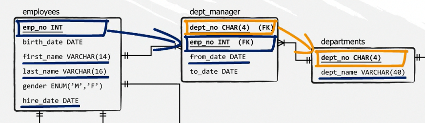

## Database Creation

```sql
CREATE DATABASE IF NOT EXISTS database_name;
```

```sql
CREATE SCHEMA IF NOT EXISTS database_name;
```

---

## Comments

```sql
/*
Comment Block
*/

# Comment

-- Comment
```

## Data Types

### String

- `CHAR(SIZE)`
  - 50% faster
  - Size Max: 255 bytes
  - `CHAR(5)`: 'Bob' -> length: 3, size: **5**
- `VARCHAR(SIZE)`
  - Size Max: 65,535 bytes
  - `VARCHAR(5)`: 'Bob' -> length: 3, size: **3**
- `ENUM('M', 'F')`

Functions:

- `CONCAT('My', 'S', 'QL')`: 'MySQL'
- `CONCAT_WS(',','First name','Second name','Last Name')`: 'First name,Second name,Last Name'

### Integers

| Type        | Bytes | Min                        | Max                       |
| ----------- | ----- | -------------------------- | ------------------------- |
| `TINYINT`   | 1     | -128                       | 127                       |
| `SMALLINT`  | 2     | -32,768                    | 32,767                    |
| `MEDIUMINT` | 3     | -8,388,608                 | 8,388,607                 |
| `INT`       | 4     | -2,147,483,648             | 2,147,483,647             |
| `BIGINT`    | 8     | -9,223,372,036,854,775,808 | 9,223,372,036,854,775,807 |

### Fixed

- `DECIMAL(2+3,3)`: 10.523 , 36.875
  - 10.5 -> 10.500
  - 10.5236 -> 10.524
- `DECIMAL(7) | DECIMAL(7+0,0)`: 1234567
- aka `NUMERIC`

### Floating Point

- `FLOAT(2+3,3)`: 10.523 , 36.875
- `DOUBLE(X,Y)`

### Date

Types:

- `DATE`: YYYY-MM-DD
- `DATETIME`: YYYY-MM-DD HH:MM:SS
- `TIMESTAMP`: Time past since 1970

Functions:

- `CURDATE()`: '2008-06-13'
- `CURTIME()`: '23:50:26'
- `UTC_TIMESTAMP()`: '2003-08-14 18:08:04'
- `DATE('2003-12-31 01:02:03')`: '2003-12-31'
- `TIME('2003-12-31 01:02:03')`: '01:02:03'
- `TIMEDIFF('2008-12-31 23:59:59.000001', '2008-12-30 01:01:01.000002'`: '46:58:57.999999'
- `DATEDIFF('2010-11-30 23:59:59','2010-12-31')`: -31
- `YEAR('1987-01-01')`: 1987
- `MONTH('2008-02-03')`: 2
- `DAYOFMONTH('2007-02-03')`: 3
- `DAYNAME('2007-02-03')`: 'Saturday'
- `HOUR('10:05:03')`: 10
- `MINUTE('2008-02-03 10:05:03')`: 5
- `SECOND('10:05:03')`: 3

## Binary Data

- `BLOB`

---

## Table Creation

```sql
CREATE TABLE table_name
(
  col_name data_type constraints,
  ...
);
```

```sql
CREATE TABLE sales
(
  purchase_number INT NOT NULL PRIMARY KEY AUTO_INCREMENT,
  date_of_purchase DATE NOT NULL,
  customer_id INT,
  item_code VARCHAR(10) NOT NULL
);
```

## Deleting Tables

```sql
DROP TABLE table_name;
```

---

## Constraints

### PRIMARY KEY

```sql
CREATE TABLE sales
(
  purchase_number INT NOT NULL AUTO_INCREMENT,
  date_of_purchase DATE NOT NULL,
  customer_id INT,
  item_code VARCHAR(10) NOT NULL,
  PRIMARY KEY (purchase_number)
);
```

### FOREIGN KEY

```sql
FOREIGN KEY (current_table_col_name) REFERENCES foreign_table_name(foreign_table_col_name)
```

```sql
CREATE TABLE sales
(
  purchase_number INT NOT NULL AUTO_INCREMENT,
  date_of_purchase DATE NOT NULL,
  customer_id INT,
  item_code VARCHAR(10) NOT NULL,
  PRIMARY KEY (purchase_number),
  FOREIGN KEY (customer_id) REFERENCES customers(customer_id) ON DELETE CASCADE
);
```

- `ON DELETE CASCADE`
  - Automatically deletes records from current table if corresponding record from foreign table gets removed.

#### Modifying already existing table:

- Sets `customer_id` column to a foreign key:

  ```sql
  ALTER TABLE sales
  ADD FOREIGN KEY (customer_id) REFERENCES customers(cutomer_id) ON DELETE CASCADE;
  ```

- Removes the foreign key:
  ```sql
  ALTER TABLE sales
  DROP FOREIGN KEY fk_name;
  ```

### UNIQUE

```sql
CREATE TABLE customers
(
  customer_id INT,
  first_name VARCHAR(255),
  last_name VARCHAR(255),
  email_address VARCHAR(255),
  number_of_complaints INT,
  PRIMARY KEY (customer_id),
  UNIQUE KEY (email_address)
);
```

#### Modifying already existing table:

- Sets `email_address` column to a unique key:

  ```sql
  ALTER TABLE customers
  ADD UNIQUE KEY (email_address);
  ```

- Removes the unique key:
  ```sql
  ALTER TABLE customers
  DROP INDEX email_address;
  ```

### DEFAULT

```sql
CREATE TABLE customers
(
  customer_id INT,
  first_name VARCHAR(255),
  last_name VARCHAR(255),
  email_address VARCHAR(255),
  number_of_complaints INT DEFAULT 0,
  PRIMARY KEY (customer_id)
);
```

#### Modifying already existing table:

```sql
ALTER TABLE customers
CHANGE COLUMN number_of_complaints number_of_complaints INT DEFAULT 0;
```

### NOT NULL

```sql
CREATE TABLE companies
(
  company_id INT AUTO_INCREMENT,
  headquarters_phone_number VARCHAR(255),
  company_name VARCHAR(255) NOT NULL,
  PRIMARY KEY (company_id)
);
```

### Modifying already existing table:

**NOTE**: To drop the `NOT NULL` constraint, `MODIFY` should be used instead of `CHANGE COLUMN`.

```sql
ALTER TABLE companies
MODIFY company_name VARCHAR(255) NULL;
```

```sql
ALTER TABLE companies
CHANGE COLUMN company_name company_name VARCHAR(255) NOT NULL;
```

---

## SELECT

```sql
SELECT *
FROM table_name
```

```sql
SELECT col_1, col_2, ...
FROM table_name
```

### WHERE

```sql
SELECT *
FROM employees
WHERE first_name = 'Denis';
```

### AND

```sql
SELECT *
FROM employees
WHERE first_name = 'Denis' AND gender = 'M';
```

### OR

```sql
SELECT *
FROM employees
WHERE first_name = 'Denis' OR first_name = 'Domenick';
```

### IN / NOT IN

```sql
SELECT *
FROM employees
WHERE first_name IN ('Denis','Domenick');
```

### LIKE / NOT LIKE

- **NOTE**

  - **MySQL** is _case-insensitive_.
  - **PostgreSQL** is _case-sensitive_, use `ILIKE` instead.

- **Sequence** of characters

  - `Foo%`: Starts with `Foo`
  - `%bar`: Ends with `bar`
  - `%baz%`: Contains `baz`

- **Single** character
  - `Mar_`: Matches `Mark`, `Marv`, ...

```sql
SELECT *
FROM employees
WHERE first_name LIKE ('Mar%');
```

### BETWEEN ... AND ... / NOT

```sql
SELECT *
FROM employees
WHERE hire_date BETWEEN '1990-01-01' AND '2000-01-01';
```

### IS NULL / IS NOT NULL

```sql
SELECT *
FROM employees
WHERE first_name IS NOT NULL;
```

### DISTINCT

```sql
SELECT DISTINCT gender
FROM employees;
```

### COUNT

```sql
SELECT COUNT(emp_no)
FROM employees;
```

```sql
SELECT COUNT(DISTINCT last_name)
FROM employees;
```

### ORDER BY

```sql
SELECT *
FROM employees
ORDER BY last_name ASC , hire_date DESC;
```

### GROUP BY

- **NOTE**
  - Grouping happens first.
  - Like `DISTINCT`, groups by distinct values.
  - Is used along aggregate functions like `COUNT`, `AVG`, `SUM`, `MIN`, `MAX`, ...

```sql
SELECT first_name, COUNT(first_name)
FROM employees
GROUP BY first_name
ORDER BY first_name;
```

### AS

Column name aliasing.

```sql
SELECT first_name, COUNT(first_name) AS names_count
FROM employees
GROUP BY first_name
ORDER BY names_count;
```

### HAVING

- **NOTE**:

  - Should be inserted between `GROUP BY` and `ORDER BY`
  - Gets applied to the `GROUP BY` block

- Extract a list of all names that are encountered less than 200 times. Let the data refer to people hired after the 1st of January 1999.

  ```sql
  SELECT first_name, COUNT(first_name) as names_count
  FROM employees
  WHERE hire_date > '1999-01-01'
  GROUP BY first_name
  HAVING names_count < 200
  ORDER BY first_name DESC;
  ```

### LIMIT

```sql
SELECT *
FROM salaries
ORDER BY salary DESC
LIMIT 10;
```

---

## INSERT

```sql
INSERT INTO table_name (column_1, column_2, ...)
VALUES (value_1, value_2, ...);
```

```sql
INSERT INTO employees
(
  emp_no,
  birth_date,
  first_name,
  last_name,
  gender,
  hire_date
)
VALUES
(
  999901,
  '1986-04-21',
  'John',
  'Smith',
  'M',
  '2011-01-01'
);
```

- **NOTE**: Column names can be omitted.

  - Values must be provided in same order as table columns
  - No missing values.

  ```sql
  INSERT INTO employees
  VALUES
  (
    999901,
    '1986-04-21',
    'John',
    'Smith',
    'M',
    '2011-01-01'
  );
  ```

### Copying Data From Another Table

```sql
INSERT INTO table_2 (column_1, column_2, ...)
SELECT column_1, column_2, ...
FROM table_1
WHERE conditions;
```

```sql
INSERT INTO departments_dup
(
  dept_no,
  dept_name
)
SELECT *
FROM departments;
```

---

## UPDATE

```sql
UPDATE table_name
SET column_1 = value_1, column_2 = value_2, ...
WHERE conditions;
```

- **NOTE**: Without `WHERE` clause, all of the table rows will be affected.

- Updates specific record with `emp_no = 999901`, leaves `hire_date` column untouched.

  ```sql
  UPDATE employees
  SET
    first_name = 'Stella',
    last_name = 'Parkinson',
    birth_date = '1990-12-31',
    gender = 'F'
  WHERE
    emp_no = 999901;
  ```

## COMMIT

- Saves current state of the database.
- Can not _rollback_ to previous state of the database anymore.

```sql
COMMIT;
```

## ROLLBACK

- Rolls back to the previous state of the database saved through `COMMIT` command; if not found, returns to the beginning of the entire SQL code.

```sql
ROLLBACK;
```

---

## DELETE

```sql
DELETE FROM table_name
WHERE conditions;
```

- **NOTE**: **Clears** the whole table Without `WHERE` clause.

### ON DELETE CASCADE

- Removes rows from child tables with a _Foreign Key_ referencing parent tables.

## DROP

```sql
DROP TABLE table_name;
```

- Removes the whole table.
- **Unable** to rollback to its initial state, or the last `COMMIT` state.

## TRUNCATE

```sql
TRUNCATE TABLE table_name;
```

- Removes all records from the table. Just like `DELETE table_name;` without `WHERE` clause.
- Resets the `AUTO_INCREMENT`.

---

## COUNT

```sql
SELECT COUNT(salary)
FROM salaries;
```

- Count distinct values:

  ```sql
  SELECT COUNT(DISTINCT salary)
  FROM salaries;
  ```

- Return the number of all rows, including `NULL` values:

  ```sql
  SELECT COUNT(*)
  FROM salaries;
  ```

## SUM

```sql
SELECT SUM(salary)
FROM salaries;
```

## MIN / MAX

```sql
SELECT MAX(salary)
FROM salaries;
```

## AVG

```sql
SELECT AVG(salary)
FROM salaries;
```

## ROUND

`ROUND(number, decimal_places)`

```sql
SELECT ROUND(AVG(salary),2)
FROM salaries;
```

## IFNULL / COALESCE

- `IFNULL` returns the first value if it is not `null`, and returns the second value if `null`.

  ```sql
  SELECT dept_no, IFNULL(dept_name, 'Department name not provided') AS dept_name
  FROM departments;
  ```

- `COALESCE` Accepts more parameters, and returns the first non-`null` value.

  ```sql
  SELECT dept_no, dept_name, COALESCE(dept_manager, dept_name, 'N/A') AS dept_manager
  FROM departments
  ORDER BY dept_no ASC;
  ```

---

## INNER JOIN

- Combines selected columns for both tables if the values for the joining column are _same_ and not `NULL`.

```sql
SELECT table_1.col, table_2.col
FROM table_1
JOIN table_2 ON table_1.col = table_2.col;
```

- Using table name alias:

  ```sql
  SELECT t1.col, t2.col
  FROM table_1 t1
  JOIN table_2 t2 ON t1.col = t2.col;
  ```

- Find the average salary by gender:

  ```sql
  SELECT e.gender, AVG(s.salary) AS average_salary
  FROM employees e
  JOIN salaries s ON e.emp_no = s.emp_no
  GROUP BY gender;
  ```

## LEFT JOIN

- Like `INNER JOIN`; also includes values from the left table that doesn't match the right table.
- Non-matching values from the right table will be set to `NULL`.

```sql
SELECT m.dept_no, m.emp_no, d.dept_name
FROM dept_manager m
LEFT JOIN departments d ON m.dept_no = d.dept_no
GROUP BY m.emp_no
ORDER BY m.dept_no;
```

- `GROUP BY` on the column with the most variance to get rid of possible duplicate rows.
- **LEFT**: `FROM dept_manager`
- **RIGHT**: `LEFT JOIN departments`

## RIGHT JOIN

- `LEFT JOIN` inverted.

```sql
SELECT d.dept_no, m.emp_no, d.dept_name
FROM dept_manager m
RIGHT JOIN departments d ON m.dept_no = d.dept_no
GROUP BY m.emp_no
ORDER BY d.dept_no;
```

- **LEFT**: `FROM dept_manager`
- **RIGHT**: `RIGHT JOIN departments`

## OLD JOINS

- Mimics the `INNER JOIN` behaviour.
- **SLOW**

```sql
SELECT t1.col1, t1.col2, t2.col1, t2.col2, ...
FROM table_1 t1, table_2 t2
WHERE t1.col = t2.col;
```

## WHERE CLAUSE JOINS

- Conditional `JOIN`

```sql
SELECT e.emp_no, e.first_name, e.last_name, s.salary
FROM employees e
JOIN salaries s ON e.emp_no = s.emp_no
WHERE s.salary > 145000;
```

## CROSS JOIN

[SQL CROSS JOIN](https://www.sqlshack.com/sql-cross-join-with-examples/)

> The `CROSS JOIN` is used to generate a paired combination of each row of the first table with each row of the second table. This join type is also known as cartesian join.

> The SQL queries which contain the `CROSS JOIN` keyword can be very costly.

```sql
SELECT col1, col2, ...
FROM table_1
CROSS JOIN table_2;
```

```sql
SELECT * FROM Meals
CROSS JOIN Drinks;
```


## Joining Multiple Tables

```sql
SELECT e.first_name, e.last_name, e.hire_date, m.from_date, d.dept_name
FROM employees e
JOIN dept_manager m ON e.emp_no = m.emp_no
JOIN departments d ON m.dept_no = d.dept_no;
```



- Returns average salaries by department, with more than $60,000:

  ```sql
  SELECT d.dept_name, AVG(salary) AS average_salary
  FROM departments d
  JOIN dept_manager m ON d.dept_no = m.dept_no
  JOIN salaries s ON m.emp_no = s.emp_no
  GROUP BY d.dept_name
  HAVING average_salary > 60000
  ORDER BY average_salary DESC;
  ```

## UNION

- Stacks tables vertically.
- Names, types and number of the columns should be identical.
- `UNION` displays only distinct rows (de-deuplicated)
- `UNION ALL` displays everything

```sql
SELECT e.emp_no, e.first_name, e.last_name, NULL AS dept_no, NULL AS from_date
FROM employees e
WHERE e.emp_no = 10001
UNION ALL
SELECT NULL AS emp_no, NULL AS first_name, NULL AS last_name, m.dept_no, m.from_date
FROM dept_manager m;
```

---

## Sub Queries

```sql
SELECT e.first_name, e.last_name
FROM employees e
WHERE e.emp_no IN (
  SELECT dm.emp_no
  FROM dept_manager dm
);
```

### EXISTS / NOT EXISTS

Checks whether certain row values are found within a subquery. It returns a `Boolean`, and is done row by row.

```sql
SELECT e.first_name, e.last_name
FROM employees e
WHERE EXISTS(
  SELECT *
  FROM dept_manager dm
  WHERE dm.emp_no = e.emp_no
)
ORDER BY emp_no;
```

- `IN` searches among values, faster with smaller datasets.
- `EXISTS` tests row values fro existence, faster in retrieving large amounts of data.

---

## Views

A virtual table whose contents are obtained from an existing table or tables, called base tables. The view simply shows the data contained in the base table.

It can be used as means to reduces code repetition.

```sql
CREATE VIEW view_name AS
SELECT col1, col2, ...
FROM table_name;
```

```sql
CREATE OR REPLACE VIEW v_dept_emp_latest_date AS
SELECT emp_no, MAX(from_date) AS from_date, MAX(to_date) AS to_date
FROM dept_emp
GROUP BY emp_no;
```

```sql
SELECT * FROM employees.v_dept_emp_latest_date;
```

- **NOTE**: There are multiple `from_date` and `to_date` records for employees changing departments. `GROUP BY` and `MAX` are used to filter out the latest dates, and departments per employee.

---

## Stored Procedures

- Procedures can have multiple input and output parameters.
- `INSERT`, `UPDATE` and `DELETE` operations can be performed inside procedures.

### Basic Procedures

```sql
CREATE PROCEDURE procedure_name(param_1, param_2)
```

```sql
CALL database_name.procedure_name();
```

```sql
USE employees;
DROP PROCEDURE IF EXISTS select_employees;

-- Set the default delimiter to $$
DELIMITER $$

CREATE PROCEDURE select_employees()
BEGIN
  SELECT *
  FROM employees
  LIMIT 1000;
END$$

-- Reset the default delimiter back to ;
DELIMITER ;

CALL employees.select_employees();
```

### Procedures With Input Parameters

```sql
USE employees;
DROP PROCEDURE IF EXISTS emp_salary;

DELIMITER $$
CREATE PROCEDURE emp_salary(IN p_emp_no INTEGER)
BEGIN
  SELECT e.first_name, e.last_name, s.salary, s.from_date, s.to_date
  FROM employees e
  JOIN salaries s ON e.emp_no = s.emp_no
  WHERE e.emp_no = p_emp_no;
END$$
DELIMITER ;

CALL employees.emp_salary(11300);
```

### Procedures With Output Parameters

```sql
USE employees;
DROP PROCEDURE IF EXISTS emp_avg_salary_out;

DELIMITER $$
CREATE PROCEDURE emp_avg_salary_out(IN p_emp_no INTEGER, OUT p_avg_salary DECIMAL(10,2))
BEGIN
  SELECT AVG(s.salary) INTO p_avg_salary
  FROM employees e
  JOIN salaries s ON e.emp_no = s.emp_no
  WHERE e.emp_no = p_emp_no;
END$$
DELIMITER ;

SET @p_avg_salary = 0;
CALL employees.emp_avg_salary_out(11300, @p_avg_salary);
SELECT @p_avg_salary;
```

## Variables

### Local Variables

- Enclosed in a `BEGIN` and `END` block.

```sql
BEGIN
DECLARE variable_name data_type
END
```

### Session Variables

- Lives through **current session (connection)** only, and is accessible in all _Query_ tabs.

```sql
SET @v_avg_salary = 0;
CALL employees.emp_avg_salary_out(11300, @v_avg_salary);
SELECT @v_avg_salary;
```

### Global Variables

- A group of predefined system variables.
- Is accessible in **all sessions**.

```sql
SET GLOBAL var_name = value;
-- or
SET @@global.var_name = value;
```

```sql
SET GLOBAL max_connections = 1000;
-- or
SET @@global.max_connections = 1;
```

## Functions

- Functions can only return a single value.
- `INSERT`, `UPDATE` and `DELETE` operations **should not** be performed inside functions.

```sql
DELIMITER $$

CREATE FUNCTON func_name(parameter data_type) RETURNS data_type
BEGIN
DECLARE variable_name data_type
  SELECT ...
RETURN variable_name
END$$

DELIMITER ;
```

```sql
USE employees;
DROP FUNCTION IF EXISTS f_emp_avg_salary;

DELIMITER $$
CREATE FUNCTION f_emp_avg_salary(p_emp_no INTEGER) RETURNS DECIMAL(10,2)
-- DETERMINISTIC, NO SQL, READS SQL DATA
BEGIN
DECLARE v_avg_salary DECIMAL(10,2);

  SELECT AVG(s.salary) INTO v_avg_salary
  FROM employees e
  JOIN salaries s ON e.emp_no = s.emp_no
  WHERE e.emp_no = p_emp_no;

RETURN v_avg_salary;
END$$
DELIMITER ;

SELECT f_emp_avg_salary(11300);
```

```sql
SET @v_emp_no = 11300;

SELECT emp_no, first_name, last_name, f_emp_avg_salary(@v_emp_no) AS avg_salary
FROM employees
WHERE emp_no = @v_emp_no;
```

---

## INDEX

- Improves performance of searches inside large databases.
- `PRIMARY KEY` and `UNIQUE` also act as indexes.

```sql
CREATE INDEX index_name
ON table_name (col_1, col_2, ...);
```

```sql
SELECT *
FROM employees
WHERE hire_date > '2000-01-01';

CREATE INDEX i_hire_date
ON employees(hire_date);
```

```sql
-- list table indexes
SHOW INDEX
FROM table_name
FROM database_name;
```

---

## CASE

```sql
SELECT column_names
  CASE condition
    WHEN case_1 THEN result_1
    WHEN case_2 THEN result_2
    ...
    ELSE
  END AS
FROM table_name;
```

```sql
SELECT
  emp_no,
  first_name,
  last_name,
  CASE
    WHEN gender = 'M' THEN 'Male'
    ELSE 'Female'
  END AS gender
FROM
  employees;

-- or
SELECT
  emp_no,
  first_name,
  last_name,
  CASE gender
    WHEN 'M' THEN 'Male'
    ELSE 'Female'
  END AS gender
FROM
  employees;
```

```sql
SELECT
  e.emp_no,
  e.first_name,
  e.last_name,
  CASE
    WHEN dm.emp_no IS NOT NULL THEN 'Manager'
    ELSE 'Employee'
  END AS is_manager
FROM
  employees e
LEFT JOIN dept_manager dm ON dm.emp_no = e.emp_no
WHERE
  e.emp_no > 109990;

-- this will not work
SELECT
  e.emp_no,
  e.first_name,
  e.last_name,
  CASE dm.emp_no
    WHEN NOT NULL THEN 'Manager'
    ELSE 'Employee'
  END AS is_manager
FROM
  employees e
LEFT JOIN dept_manager dm ON dm.emp_no = e.emp_no
WHERE
  e.emp_no > 109990;
```

```sql
SELECT
  emp_no,
  first_name,
  last_name,
  IF(gender = 'M', 'Male', 'Female') AS gender
FROM
  employees;
```
